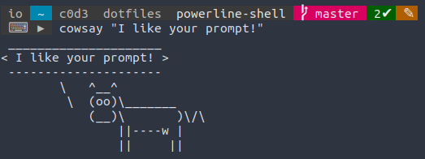

# powerline-shell

Configuration for [powerline-shell](https://github.com/b-ryan/powerline-shell).

Put in `~/.config/powerline-shell`.

NOTE: I use this config with bash, not fish, but it should work on fish also.

